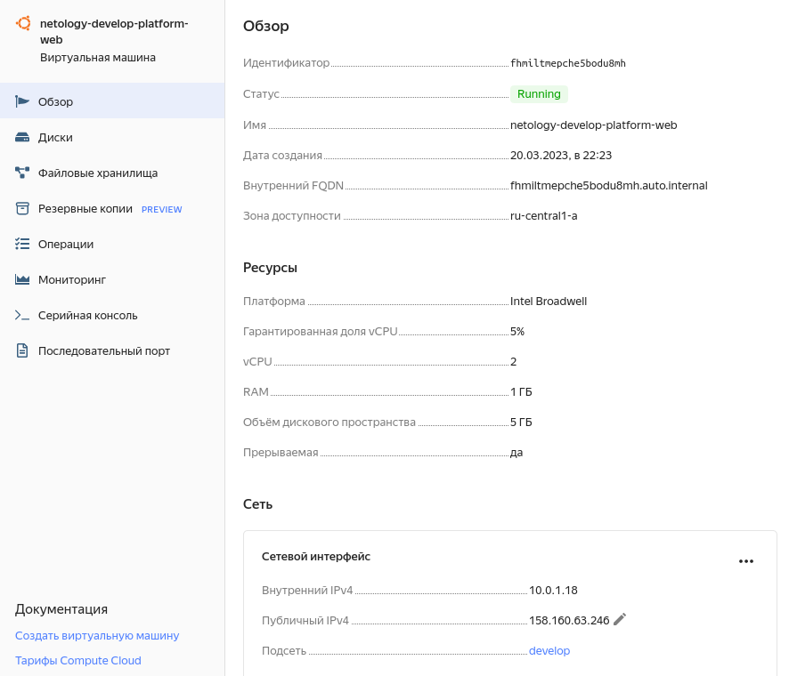
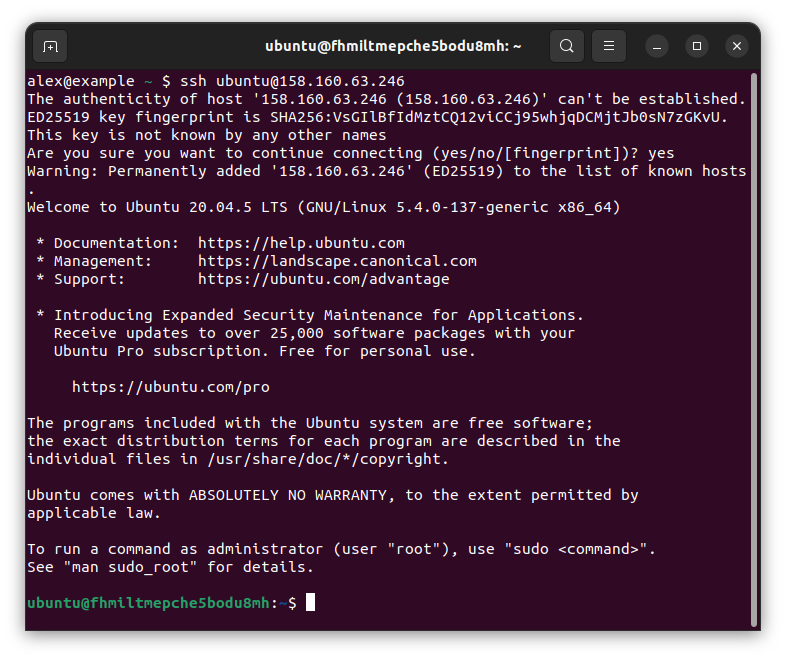

# Домашнее задание к занятию "Основы Terraform. Yandex Cloud"

### Задание 0

С документацией ознакомился, доступ запросил.

### Задание 1

Скриншот ЛК Yandex Cloud с созданной ВМ:
 

Скриншот успешного подключения к консоли ВМ через ssh:


Ответы на вопросы:

> Инициализируйте проект, выполните код. Исправьте возникшую ошибку. Ответьте в чем заключается ее суть?

Для платформы `standard-v1` не поддерживаются конфигурации с 1 ядром CPU. Допустимое количество ядер - 2 или 4.

> Ответьте, что означает ```preemptible = true``` и ```core_fraction``` в параметрах ВМ? Как это может пригодиться 
> в процессе обучения? Ответ в документации Yandex cloud.
 
`preemptible = true` создаёт прерываемую ВМ. Прерываемые виртуальные машины — это виртуальные машины,
которые могут быть принудительно остановлены провайдером в любой момент.

`core_fraction` задаёт базовый уровень производительности vCPU. Этот уровень определяет долю вычислительного времени 
физических ядер, которую гарантирует vCPU.

Создание прерываемых ВМ с низким уровнем производительности существенно экономит расходы. В процессе обучения обычно 
не требуется круглосуточный доступ и высокая производительность ресурсов. 

### Задание 2

Заменил захардкоженные значения на переменные. Выполнил команду `terraform plan` - изменений нет.

### Задание 3

Перенёс переменные в `vms_platform.tf`. Применил изменения

### Задание 4

Объявил переменные в `outputs.tf`. Применил изменения.

```bash
(venv) alex@example ~/repo/netology-terraform/terraform02/src (terraform-02) $ terraform output
vm_db_external_ip_address = "158.160.35.196"
vm_web_external_ip_address = "158.160.63.246"
```

### Задание 5

Описал имена ВМ в `locals.tf`. Применил изменения.

### Задание 6

Объединил переменные в map, удалил неиспользуемые переменные. Выполнил команду `terraform plan` - изменений нет.

------

### Задание 7*

1. Напишите, какой командой можно отобразить **второй** элемент списка test_list?
    ```
    > local.test_list[1]
    "staging"
    ```
2. Найдите длину списка test_list с помощью функции length(<имя переменной>).
    ```
    > length(local.test_list)
    3
    ```
3. Напишите, какой командой можно отобразить значение ключа admin из map test_map ?
    ```
    > local.test_map.admin
    "John"
    ``` 
4. Напишите interpolation выражение, результатом которого будет: "John is admin for production server based on OS ubuntu-20-04 with X vcpu, Y ram and Z virtual disks", используйте данные из переменных test_list, test_map, servers и функцию length() для подстановки значений.
    ```
    > "${ local.test_map.admin } is ${ keys(local.test_map).0 } for ${ local.test_list[2] } server based on OS ${ local.servers.production.image } with ${ local.servers.production.cpu } vcpu, ${ local.servers.production.ram } ram and ${ length(local.servers.production.disks) } virtual disks"
   "John is admin for production server based on OS ubuntu-20-04 with 10 vcpu, 40 ram and 4 virtual disks"

    ```


