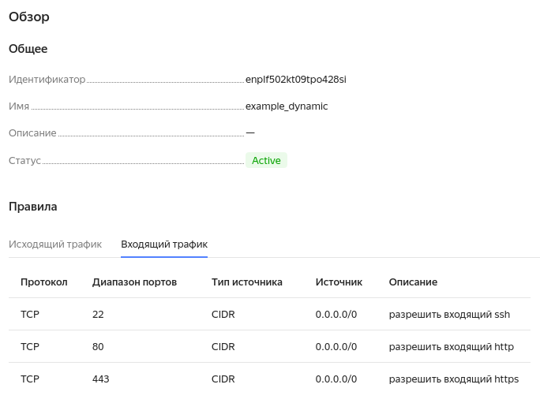

# Домашнее задание к занятию "Управляющие конструкции в коде Terraform"

### Задание 1

Изучил проект, заполнил файл `personal.auto.tfvars`, инициализировал проект, выполнил код.

Скриншот входящих правил "Группы безопасности" в ЛК Yandex Cloud:


### Задание 2

Создал файлы, добавил функцию file для SSH-ключа, инициализировал проект, выполнил код.

### Задание 3

Создал диски и ВМ, назначил группу безопасности. 

### Задание 4

Создал inventory-файл для ansible. Содержимое `hosts.cfg`:
```
[webservers]

netology-develop-platform-web-0  ansible_host=158.160.32.85

netology-develop-platform-web-1  ansible_host=158.160.44.245

netology-develop-platform-web2-0  ansible_host=62.84.119.36

netology-develop-platform-web2-1  ansible_host=62.84.116.173
```

### Задание 5*(необязательное)

Создал output, вывод команды `terraform output`:
```
all_vms = [
  {
    "fqdn" = "fhm06lvjef5trajk6bsq.auto.internal"
    "id" = "fhm06lvjef5trajk6bsq"
    "name" = "netology-develop-platform-web-0"
  },
  {
    "fqdn" = "fhm97g61ufh6fuj6r50r.auto.internal"
    "id" = "fhm97g61ufh6fuj6r50r"
    "name" = "netology-develop-platform-web-1"
  },
  {
    "fqdn" = "fhmr24in0c1u04vd5unq.auto.internal"
    "id" = "fhmr24in0c1u04vd5unq"
    "name" = "netology-develop-platform-web2-0"
  },
  {
    "fqdn" = "fhmqbppn746tlaoroh2v.auto.internal"
    "id" = "fhmqbppn746tlaoroh2v"
    "name" = "netology-develop-platform-web2-1"
  },
  {
    "fqdn" = "fhmjl14h00evcr19mvtk.auto.internal"
    "id" = "fhmjl14h00evcr19mvtk"
    "name" = "netology-develop-platform-web-4discs"
  },
]

```

### Задание 6*(необязательное)

Применил ansible-playbook к ВМ из ansible inventory файла.
Изменил конфигурацию ВМ, созданных через `count`:
```
  network_interface {
    subnet_id = yandex_vpc_subnet.develop.id
   # nat       = var.vm_web_nat_settings
    nat = false
  }
```

Дополнил шаблон hosts.tftpl. Содержимое `hosts.cfg`:
```
[webservers]

netology-develop-platform-web-0  ansible_host=10.0.1.7

netology-develop-platform-web-1  ansible_host=10.0.1.13

netology-develop-platform-web2-0  ansible_host=62.84.119.36

netology-develop-platform-web2-1  ansible_host=62.84.116.173
```

