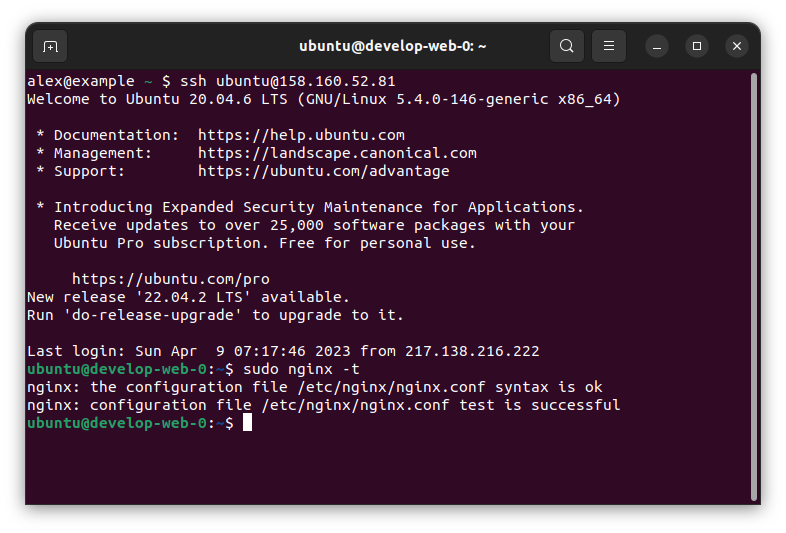
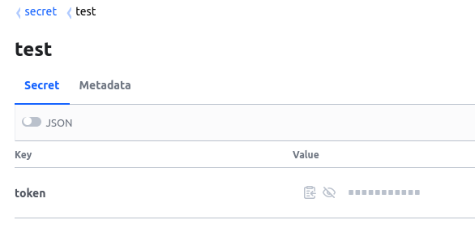

# Домашнее задание к занятию "Продвинутые методы работы с Terraform"

### Задание 1

Создал ВМ, добавил установку nginx. Cкриншот подключения к консоли и вывод команды ```sudo nginx -t```:


### Задание 2

Создал модуль, сгенерировал документацию командой 

`terraform-docs -c .terraform-docs.yml vpc/`:

## Requirements

| Name | Version |
|------|---------|
| <a name="requirement_terraform"></a> [terraform](#requirement\_terraform) | >=0.13 |

## Providers

| Name | Version |
|------|---------|
| <a name="provider_yandex"></a> [yandex](#provider\_yandex) | n/a |

## Modules

No modules.

## Resources

| Name | Type |
|------|------|
| [yandex_vpc_network.develop](https://registry.terraform.io/providers/yandex-cloud/yandex/latest/docs/resources/vpc_network) | resource |
| [yandex_vpc_subnet.develop](https://registry.terraform.io/providers/yandex-cloud/yandex/latest/docs/resources/vpc_subnet) | resource |

## Inputs

| Name | Description | Type | Default | Required |
|------|-------------|------|---------|:--------:|
| <a name="input_cloud_id"></a> [cloud\_id](#input\_cloud\_id) | https://cloud.yandex.ru/docs/resource-manager/operations/cloud/get-id | `string` | n/a | yes |
| <a name="input_env_network_name"></a> [env\_network\_name](#input\_env\_network\_name) | Network name | `string` | n/a | yes |
| <a name="input_env_subnet_name"></a> [env\_subnet\_name](#input\_env\_subnet\_name) | Subnet name | `string` | n/a | yes |
| <a name="input_folder_id"></a> [folder\_id](#input\_folder\_id) | https://cloud.yandex.ru/docs/resource-manager/operations/folder/get-id | `string` | n/a | yes |
| <a name="input_token"></a> [token](#input\_token) | OAuth-token; https://cloud.yandex.ru/docs/iam/concepts/authorization/oauth-token | `string` | n/a | yes |
| <a name="input_vpc_name"></a> [vpc\_name](#input\_vpc\_name) | VPC network&subnet name | `string` | `"develop"` | no |

## Outputs

| Name | Description |
|------|-------------|
| <a name="output_subnet_id"></a> [subnet\_id](#output\_subnet\_id) | Subnet id |
| <a name="output_vpc_id"></a> [vpc\_id](#output\_vpc\_id) | Network id |


### Задание 3
1. Вывел список ресурсов в стейте:
    ```
    terrraform state list
    ```
    ```
    data.template_file.cloud-init
    module.test-vm.data.yandex_compute_image.my_image
    module.test-vm.yandex_compute_instance.vm[0]
    module.vpc_dev.yandex_vpc_network.develop
    module.vpc_dev.yandex_vpc_subnet.develop
    ```
2. Удалил из стейта модуль vpc.
   ```
   terraform state rm 'module.vpc_dev'
   ```
   ```
   Removed module.vpc_dev.yandex_vpc_network.develop
   Removed module.vpc_dev.yandex_vpc_subnet.develop
   Successfully removed 2 resource instance(s).
   ```
3. Импортировал модуль обратно. В `terraform plan` изменений нет.
   ```
   terraform import "module.vpc_dev.yandex_vpc_network.develop" enpca92toc9upfo7lhkp
   ```
   ```
   data.template_file.cloud-init: Reading...
   data.template_file.cloud-init: Read complete after 0s [id=ebc8e2f2ba8c603aac75242ee9ee69e0fdb5096e0637ac5286e49a7000a607fe]
   module.vpc_dev.yandex_vpc_network.develop: Importing from ID "enpca92toc9upfo7lhkp"...
   module.vpc_dev.yandex_vpc_network.develop: Import prepared!
   Prepared yandex_vpc_network for import
   module.test-vm.data.yandex_compute_image.my_image: Reading...
   module.vpc_dev.yandex_vpc_network.develop: Refreshing state... [id=enpca92toc9upfo7lhkp]
   module.test-vm.data.yandex_compute_image.my_image: Read complete after 2s [id=fd8tckeqoshi403tks4l]

   Import successful!

   The resources that were imported are shown above. These resources are now in
   your Terraform state and will henceforth be managed by Terraform.
   ```
   ```
   terraform import "module.vpc_dev.yandex_vpc_subnet.develop" e9bcfp87ejs8dg10ahrf
   ```
   ```
   module.test-vm.data.yandex_compute_image.my_image: Reading...
   data.template_file.cloud-init: Reading...
   data.template_file.cloud-init: Read complete after 0s [id=ebc8e2f2ba8c603aac75242ee9ee69e0fdb5096e0637ac5286e49a7000a607fe]
   module.vpc_dev.yandex_vpc_subnet.develop: Importing from ID "e9bcfp87ejs8dg10ahrf"...
   module.vpc_dev.yandex_vpc_subnet.develop: Import prepared!
   Prepared yandex_vpc_subnet for import
   module.vpc_dev.yandex_vpc_subnet.develop: Refreshing state... [id=e9bcfp87ejs8dg10ahrf]
   module.test-vm.data.yandex_compute_image.my_image: Read complete after 3s [id=fd8tckeqoshi403tks4l]

   Import successful!

   The resources that were imported are shown above. These resources are now in
   your Terraform state and will henceforth be managed by Terraform.
   ```
   ```
   terraform plan
   ```
   ```
   data.template_file.cloud-init: Reading...
   data.template_file.cloud-init: Read complete after 0s [id=ebc8e2f2ba8c603aac75242ee9ee69e0fdb5096e0637ac5286e49a7000a607fe]
   module.vpc_dev.yandex_vpc_network.develop: Refreshing state... [id=enpca92toc9upfo7lhkp]
   module.test-vm.data.yandex_compute_image.my_image: Reading...
   module.test-vm.data.yandex_compute_image.my_image: Read complete after 3s [id=fd8tckeqoshi403tks4l]
   module.vpc_dev.yandex_vpc_subnet.develop: Refreshing state... [id=e9bcfp87ejs8dg10ahrf]
   module.test-vm.yandex_compute_instance.vm[0]: Refreshing state... [id=fhmd5uq6qpm65snhc5sk]

   No changes. Your infrastructure matches the configuration.

   Terraform has compared your real infrastructure against your configuration and found no differences, so no changes are needed.
   ```

### Задание 4*

Изменил модуль vpc. Результат из консоли YC:

```
yc vpc subnet list
```
```
+----------------------+------------------------------+----------------------+----------------+---------------+-----------------+
|          ID          |             NAME             |      NETWORK ID      | ROUTE TABLE ID |     ZONE      |      RANGE      |
+----------------------+------------------------------+----------------------+----------------+---------------+-----------------+
| b0ch5chcjgsnqnikj0fp | develop subnet-ru-central1-c | enpca92toc9upfo7lhkp |                | ru-central1-c | [10.0.3.0/24]   |
| b0ci28oh18ihtons7q1q | default-ru-central1-c        | enpfv43tmihcte1entt1 |                | ru-central1-c | [10.130.0.0/24] |
| e2lo3h563jbkfb8k02pm | default-ru-central1-b        | enpfv43tmihcte1entt1 |                | ru-central1-b | [10.129.0.0/24] |
| e2lpfaf82pde0atece53 | develop subnet-ru-central1-b | enpca92toc9upfo7lhkp |                | ru-central1-b | [10.0.2.0/24]   |
| e9b230vhj9nmjsenl1lg | default-ru-central1-a        | enpfv43tmihcte1entt1 |                | ru-central1-a | [10.128.0.0/24] |
| e9bof6jsjkk4t8oond54 | develop subnet-ru-central1-a | enpca92toc9upfo7lhkp |                | ru-central1-a | [10.0.1.0/24]   |
+----------------------+------------------------------+----------------------+----------------+---------------+-----------------+
```

### Задание 5**

Написал модули для создания кластера и БД. Создал кластер example из одного хоста, добавил в него БД test и пользователя app. 
```
yc managed-mysql cluster list
```
```
+----------------------+---------+---------------------+--------+---------+
|          ID          |  NAME   |     CREATED AT      | HEALTH | STATUS  |
+----------------------+---------+---------------------+--------+---------+
| c9qn8kmhfaadlk0hfng0 | example | 2023-04-11 12:11:01 | ALIVE  | RUNNING |
+----------------------+---------+---------------------+--------+---------+
```
```
yc managed-mysql hosts list --cluster-name=example
```
```
+-------------------------------------------+----------------------+--------+--------+---------------+-----------+--------------------+----------+-----------------+
|                   NAME                    |      CLUSTER ID      |  ROLE  | HEALTH |    ZONE ID    | PUBLIC IP | REPLICATION SOURCE | PRIORITY | BACKUP PRIORITY |
+-------------------------------------------+----------------------+--------+--------+---------------+-----------+--------------------+----------+-----------------+
| rc1a-hpmshnrfcaltew1x.mdb.yandexcloud.net | c9qn8kmhfaadlk0hfng0 | MASTER | ALIVE  | ru-central1-a | false     |                    |        0 |               0 |
+-------------------------------------------+----------------------+--------+--------+---------------+-----------+--------------------+----------+-----------------+
```
```
yc managed-mysql database list --cluster-name=example
```
```
+------+----------------------+
| NAME |      CLUSTER ID      |
+------+----------------------+
| test | c9qn8kmhfaadlk0hfng0 |
+------+----------------------+
```
```
yc managed-mysql users list --cluster-name=example
```
```
+------+-------------+
| NAME | PERMISSIONS |
+------+-------------+
| app  | test        |
+------+-------------+
```
Изменил значение переменной ha на true, в кластер добавились 2 хоста.
```
yc managed-mysql hosts list --cluster-name=example
```
```
+-------------------------------------------+----------------------+---------+--------+---------------+-----------+--------------------+----------+-----------------+
|                   NAME                    |      CLUSTER ID      |  ROLE   | HEALTH |    ZONE ID    | PUBLIC IP | REPLICATION SOURCE | PRIORITY | BACKUP PRIORITY |
+-------------------------------------------+----------------------+---------+--------+---------------+-----------+--------------------+----------+-----------------+
| rc1a-5thl5a6tokpjbxij.mdb.yandexcloud.net | c9qn8kmhfaadlk0hfng0 | REPLICA | ALIVE  | ru-central1-a | false     |                    |        0 |               0 |
| rc1a-hpmshnrfcaltew1x.mdb.yandexcloud.net | c9qn8kmhfaadlk0hfng0 | MASTER  | ALIVE  | ru-central1-a | false     |                    |        0 |               0 |
| rc1a-loufxzbzmlawbs4b.mdb.yandexcloud.net | c9qn8kmhfaadlk0hfng0 | REPLICA | ALIVE  | ru-central1-a | false     |                    |        0 |               0 |
+-------------------------------------------+----------------------+---------+--------+---------------+-----------+--------------------+----------+-----------------+
```

### Задание 6***  

Развернул vault, создал секрет через веб-интерфейс. Получил его значение через outputs
```
Outputs:

vault_example = "congrats!"
```
Записал новый секрет в vault с помощью terraform.
```terraform
resource "vault_generic_secret" "example2" {
 data_json = file("${path.module}/secret.json")
 path      = "secret/test"
}
```



